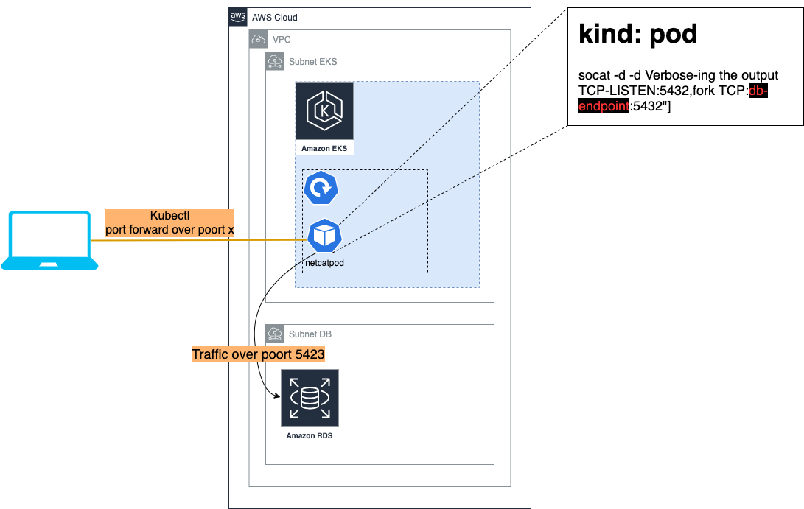

# Terraform-socat README

Cloud Legends terraform module for [socat](https://linux.die.net/man/1/socat) deployment in Kubernetes

Usage:

```hcl-terraform
module "socat" {
  source           = "git@github.com:cloud-legends/terraform-kubernetes-socat.git?ref=1.0"
  deploy_suffix    = "rds"
  namespace        = "application_namespace"
  endpoint         = "endpoint url"
  destination_port = port number
  source_port      = port number
  protocol         = "TCP"
}
```

## Configuration:
Simple terraform code that creates a Kubernetes deployment.
The deployment consists of 1 pod based on alpine that runs socat 

Socat is configured to accept `TCP` or `UDP` traffic on an incoming port that is exposed on the pod
It then forwards the traffic towards an endpoint of choice.

## Requirements

| Name | Version |
|------|---------|
| <a name="requirement_terraform"></a> [terraform](#requirement\_terraform) | >= 1.0 |

## Providers

| Name | Version |
|------|---------|
| <a name="provider_kubernetes"></a> [kubernetes](#provider\_kubernetes) | n/a |

## Resources

| Name | Type |
|------|------|
| [kubernetes_deployment.socat_deploy](https://registry.terraform.io/providers/hashicorp/kubernetes/latest/docs/resources/deployment) | resource |

## Inputs

| Name | Description | Type | Default | Required |
|------|-------------|------|---------|:--------:|
| <a name="input_deploy_suffix"></a> [deploy\_suffix](#input\_deploy\_suffix) | Name of the destination you want to interface with, this is added to the name to ensure a unique name for the deployment | `string` | `""` | no |
| <a name="input_destination_port"></a> [destination\_port](#input\_destination\_port) | Port to which socat should forward the traffic | `number` | n/a | yes |
| <a name="input_endpoint"></a> [endpoint](#input\_endpoint) | Address to which socat should forward traffic | `string` | `""` | no |
| <a name="input_namespace"></a> [namespace](#input\_namespace) | Name of the namespace in which the deployment should be placed | `string` | `""` | no |
| <a name="input_protocol"></a> [protocol](#input\_protocol) | the protocol that socat should use, options are 'TCP' or 'UDP' | `string` | `""` | no |
| <a name="input_source_port"></a> [source\_port](#input\_source\_port) | port on which socat should listen for traffic | `number` | n/a | yes |
## Result:
You can port-forward to the resulting pod(s) using `kubectl` and use a local database client to interface with the endpoint even if a direct connection from your machine is not allowed in the network itself.

## visual representation:

