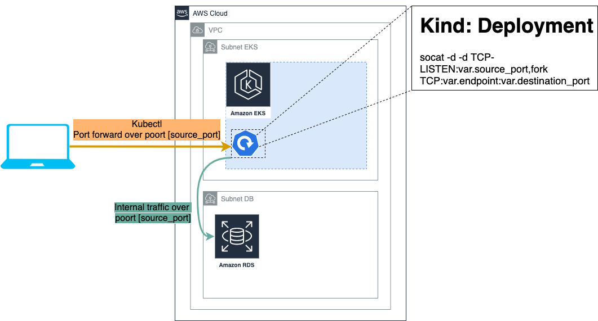

# Terraform-socat README

## Configuration:
Simple terraform code that creates a deployment.
The deployment consists of 1 pod based on alpine that runs socat 

Socat is configured to accept `TCP` traffic on an incoming port that is exposed on the pod
It then forwards `TCP` traffic towards an RDS endpoint.

## Result:
You can port-forward to the resulting pod(s) using `kubectl` and use a local database client to interface with the RDS instance.

## visual representation:

